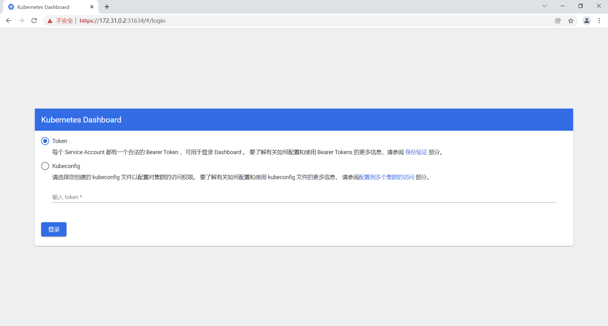
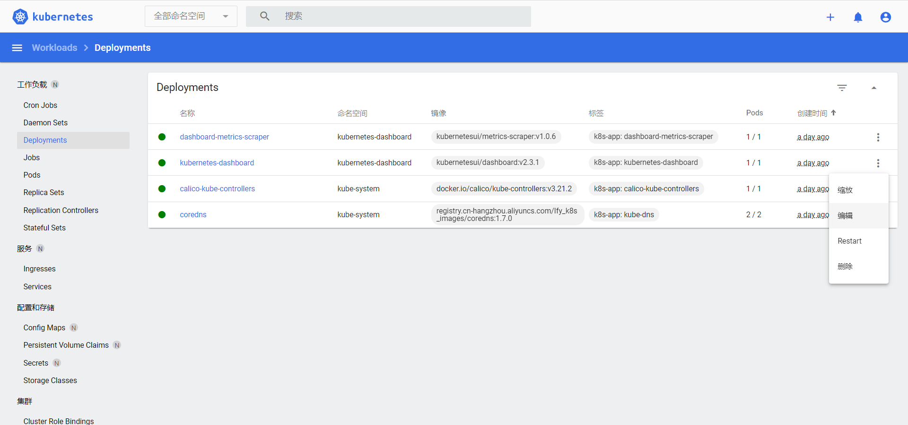
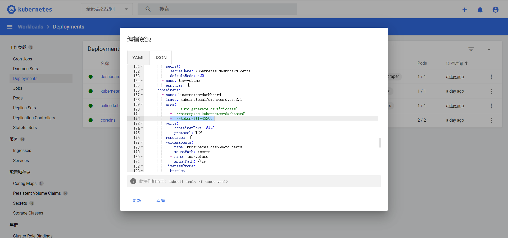

# 摘要

kubernetes 官方提供的可视化界面，https://github.com/kubernetes/dashboard 

# 部署 dashboard 

## 下载  [recommended.yaml](assets/data/recommended.yaml) 

1. recommended.yaml 实在下载不下来，我这里有一份  [recommended.yaml](assets/data/recommended.yaml) 
2. 在主节点部署 dashboard 

```sh
# 如有必要,科学上网
wget https://raw.githubusercontent.com/kubernetes/dashboard/v2.3.1/aio/deploy/recommended.yaml

```

## apply

```sh
kubectl apply -f recommended.yaml
```

## 设置访问端口

在主节点中运行：

```sh
kubectl edit svc kubernetes-dashboard -n kubernetes-dashboard
```

修改：

1.  `type: ClusterIP`  改为 `type: NodePort` 。`ClusterIP` 表示只能在集群内访问到，现在我想让它能通过节点 IP 访问
2. 添加 `nodePort: 30001` 。如果你不指定 `nodePort` ，那它就会随机生成

```yaml
... ...
spec:
  clusterIP: 10.96.129.202
  clusterIPs:
  - 10.96.129.202
  ports:
  - port: 443
    protocol: TCP
    targetPort: 8443
    nodePort: 30001
  selector:
    k8s-app: kubernetes-dashboard
  sessionAffinity: None
  type: NodePort
... ...
```

# 访问

## 查看访问端口

```
[root@k8s-master ~]# kubectl get svc -A |grep kubernetes-dashboard
kubernetes-dashboard   dashboard-metrics-scraper   ClusterIP   10.96.36.254    <none>        8000/TCP                 10m
kubernetes-dashboard   kubernetes-dashboard        NodePort    10.96.129.202   <none>        443:30001/TCP            10m
[root@k8s-master ~]#
```

由此可知，访问端口为 `30001` 

## 初次访问

1.  https://集群任意IP:nortPort 。我这里用主节点 IP `172.31.0.2` ，端口用上面的 `30001` ，则有  https://172.31.0.2:30001
2.  面临潜在的安全风险。不理他，直接继续就好
3.  看到下图，表示到目前为止是成功的



## 创建访问账号

### dash.yaml

主节点中创建 dash.yaml ：

```yaml
# 创建访问账号，准备一个yaml文件； vi dash.yaml
apiVersion: v1
kind: ServiceAccount
metadata:
  name: admin-user
  namespace: kubernetes-dashboard
---
apiVersion: rbac.authorization.k8s.io/v1
kind: ClusterRoleBinding
metadata:
  name: admin-user
roleRef:
  apiGroup: rbac.authorization.k8s.io
  kind: ClusterRole
  name: cluster-admin
subjects:
- kind: ServiceAccount
  name: admin-user
  namespace: kubernetes-dashboard
```

### apply

主节点中 kubectl apply 

```
kubectl apply -f dash.yaml
```

## 登录

### 获取访问令牌

主节点中获取访问令牌

```sh
kubectl -n kubernetes-dashboard get secret $(kubectl -n kubernetes-dashboard get sa/admin-user -o jsonpath="{.secrets[0].name}") -o go-template="{{.data.token | base64decode}}"
```

### token 登录

输入 token 后登录即可

# 设置 token 过期时间

kubenetes-dashboard 默认 token 过期时间是 900s，即 15 分钟，到期后会自动退出登陆，需要重新登录认证。为了方便使用，我们修改 token 过期时间为 43200s ，即12h

## 编辑kubernetes-dashboard

登录dashboard web端页面，切换到 **全部命名空间** ，找到 **kubenetes-dashboard**，编辑 ，如下图：




## 添加参数

在如图位置中加上 `- '--token-ttl=43200'`  ，然后点击更新就修改成功了


