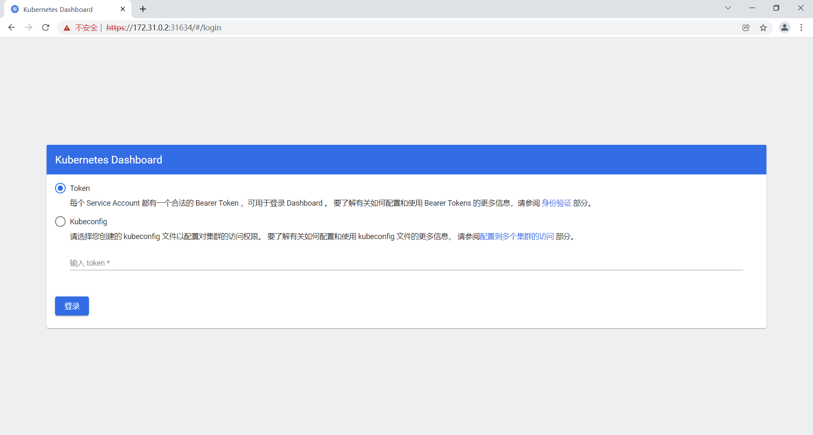

# 概述

安装 kubernetes:v1.20.9

# 安装步骤

## 环境准备

1. 安装 kubernetes 需要进行以下设置，我也不知道为什么，官网就是这么说的，跟着做吧
2. 主从节点都要进行下面的设置

```sh
# 将 SELinux 设置为 permissive 模式（相当于将其禁用）
sudo setenforce 0
sudo sed -i 's/^SELINUX=enforcing$/SELINUX=permissive/' /etc/selinux/config

#关闭swap
swapoff -a  
sed -ri 's/.*swap.*/#&/' /etc/fstab

#允许 iptables 检查桥接流量
cat <<EOF | sudo tee /etc/modules-load.d/k8s.conf
br_netfilter
EOF
cat <<EOF | sudo tee /etc/sysctl.d/k8s.conf
net.bridge.bridge-nf-call-ip6tables = 1
net.bridge.bridge-nf-call-iptables = 1
EOF

# 生效
sudo sysctl --system

```

## 安装 kubelet、kubeadm、kubectl 

主从节点都要安装 kubelet、kubeadm、kubectl 

```sh
# 设置 yum 源
cat <<EOF | sudo tee /etc/yum.repos.d/kubernetes.repo
[kubernetes]
name=Kubernetes
baseurl=http://mirrors.aliyun.com/kubernetes/yum/repos/kubernetes-el7-x86_64
enabled=1
gpgcheck=0
repo_gpgcheck=0
gpgkey=http://mirrors.aliyun.com/kubernetes/yum/doc/yum-key.gpg
   http://mirrors.aliyun.com/kubernetes/yum/doc/rpm-package-key.gpg
exclude=kubelet kubeadm kubectl
EOF

# 安装
sudo yum install -y kubelet-1.20.9 kubeadm-1.20.9 kubectl-1.20.9 --disableexcludes=kubernetes

# 启动
sudo systemctl enable --now kubelet

```

## 初始化主节点

### 添加域名映射

主从节点都要添加域名映射

```sh
# 所有机器添加 master 域名映射，我这里的 master 为 172.31.0.2
echo "172.31.0.2  cluster-endpoint" >> /etc/hosts
```

所有节点都能使用 `ping cluster-endpoint` 命令 PING 通 master 节点为配置成功

### 安装相关镜像

1. 其实这一步不是必须的，因为后面会自动下载这些镜像，但由于可能出现网络问题，不知道卡在哪里了，所以我们先准备好镜像。这里我们使用阿里云的镜像
2. 主从节点都要安装下面的镜像

```sh
docker pull registry.cn-hangzhou.aliyuncs.com/lfy_k8s_images/kube-apiserver:v1.20.9
docker pull registry.cn-hangzhou.aliyuncs.com/lfy_k8s_images/kube-proxy:v1.20.9
docker pull registry.cn-hangzhou.aliyuncs.com/lfy_k8s_images/kube-controller-manager:v1.20.9
docker pull registry.cn-hangzhou.aliyuncs.com/lfy_k8s_images/kube-scheduler:v1.20.9
docker pull registry.cn-hangzhou.aliyuncs.com/lfy_k8s_images/coredns:1.7.0
docker pull registry.cn-hangzhou.aliyuncs.com/lfy_k8s_images/etcd:3.4.13-0
docker pull registry.cn-hangzhou.aliyuncs.com/lfy_k8s_images/pause:3.2
```

如果你想知道原来的镜像是什么，你可以运行 `kubeadm config images list [--kubernetes-version <version>]` 命令查看：

```
[root@k8s-master ~]# kubeadm config images list --kubernetes-version v1.20.9
k8s.gcr.io/kube-apiserver:v1.20.9
k8s.gcr.io/kube-controller-manager:v1.20.9
k8s.gcr.io/kube-scheduler:v1.20.9
k8s.gcr.io/kube-proxy:v1.20.9
k8s.gcr.io/pause:3.2
k8s.gcr.io/etcd:3.4.13-0
k8s.gcr.io/coredns:1.7.0
```

### 主节点初始化

只有主节点需要初始化

```sh
#主节点初始化,我的 master 节点为 172.31.0.2 
kubeadm init \
--apiserver-advertise-address=172.31.0.2 \
--control-plane-endpoint=cluster-endpoint \
--image-repository registry.cn-hangzhou.aliyuncs.com/lfy_k8s_images \
--kubernetes-version v1.20.9 \
--service-cidr=10.96.0.0/16 \
--pod-network-cidr=192.168.0.0/16 
```

如果初始化成功，你应该能够看到类似于下面这样的东西：

```
... ...
Your Kubernetes control-plane has initialized successfully!

To start using your cluster, you need to run the following as a regular user:

  mkdir -p $HOME/.kube
  sudo cp -i /etc/kubernetes/admin.conf $HOME/.kube/config
  sudo chown $(id -u):$(id -g) $HOME/.kube/config
... ...
kubeadm join cluster-endpoint:6443 --token ob55n2.owwcbxxjdix40zgu \
    --discovery-token-ca-cert-hash sha256:212a1f282b6ecbc35656702bc6c75c8638c66f6f5823b7bff49448f43b64ea30
```


### 设置.kube/config

1. 根据安装成功的提示，我们需要运行下面的命令
2. 只有主节点需要运行下面的命令

```sh
mkdir -p $HOME/.kube
sudo cp -i /etc/kubernetes/admin.conf $HOME/.kube/config
sudo chown $(id -u):$(id -g) $HOME/.kube/config

```

### 安装网络组件

1. 这里选择 [calico](https://docs.projectcalico.org/getting-started/kubernetes/self-managed-onprem/onpremises#install-calico-with-kubernetes-api-datastore-more-than-50-nodes) 
2. 只有主节点需要安装网络组件
2. calico.yaml 实在下载不下来，我这里有一份  [calico.yaml](assets/data/calico.yaml) 

```bash
curl https://docs.projectcalico.org/manifests/calico.yaml -O
kubectl apply -f calico.yaml

```

## node 加入集群

### 创建令牌

主节点中创建令牌：

```
[root@k8s-master ~]# kubeadm token create --print-join-command
kubeadm join cluster-endpoint:6443 --token 9kto10.1u0e74ypj3ag4rix     --discovery-token-ca-cert-hash sha256:dd4160970cd55d5687d16ee417adad3e697dc189911d3f06a7e4dbf1066934c9 
[root@k8s-master ~]# 
```

### 从节点加入集群

复制主节点中的令牌，然后在所有从节点中执行，从节点执行成功后，你可以看到：

```
[root@k8s-node1 ~]# kubeadm join cluster-endpoint:6443 --token 9kto10.1u0e74ypj3ag4rix     --discovery-token-ca-cert-hash sha256:dd4160970cd55d5687d16ee417adad3e697dc189911d3f06a7e4dbf1066934c9 
[preflight] Running pre-flight checks
	[WARNING IsDockerSystemdCheck]: detected "cgroupfs" as the Docker cgroup driver. The recommended driver is "systemd". Please follow the guide at https://kubernetes.io/docs/setup/cri/
	[WARNING SystemVerification]: this Docker version is not on the list of validated versions: 20.10.7. Latest validated version: 19.03
[preflight] Reading configuration from the cluster...
[preflight] FYI: You can look at this config file with 'kubectl -n kube-system get cm kubeadm-config -o yaml'
[kubelet-start] Writing kubelet configuration to file "/var/lib/kubelet/config.yaml"
[kubelet-start] Writing kubelet environment file with flags to file "/var/lib/kubelet/kubeadm-flags.env"
[kubelet-start] Starting the kubelet
[kubelet-start] Waiting for the kubelet to perform the TLS Bootstrap...

This node has joined the cluster:
* Certificate signing request was sent to apiserver and a response was received.
* The Kubelet was informed of the new secure connection details.

Run 'kubectl get nodes' on the control-plane to see this node join the cluster.

[root@k8s-node1 ~]# 
```

1. 在主节点执行 `kubectl get nodes` 可以查看集群节点状态
2. 运行中的应用在 docker 里面叫容器，在k8s里面叫Pod，在主节点中使用 `kubectl get pods -A` 可查看运行中的应用。若所有应用 STATUS 为 Running ，则表示这一步成功。在这一步，我遇到过 [ImagePullBackOff](#ImagePullBackOff) 

# 部署 dashboard 

## 安装

1. kubernetes 官方提供的可视化界面，https://github.com/kubernetes/dashboard 
2. recommended.yaml 实在下载不下来，我这里有一份  [recommended.yaml](assets/data/recommended.yaml) 
3. 在主节点部署 dashboard 

```sh
# 如有必要,科学上网
wget https://raw.githubusercontent.com/kubernetes/dashboard/v2.3.1/aio/deploy/recommended.yaml

kubectl apply -f recommended.yaml
```

## 设置访问端口

在主节点中运行：

```sh
kubectl edit svc kubernetes-dashboard -n kubernetes-dashboard
```

然后在出现的文本中做出如下修改

```
type: ClusterIP 改为 type: NodePort
```

## 查看访问端口

```
[root@k8s-master ~]# kubectl get svc -A |grep kubernetes-dashboard
kubernetes-dashboard   dashboard-metrics-scraper   ClusterIP   10.96.193.91    <none>        8000/TCP                 19m
kubernetes-dashboard   kubernetes-dashboard        NodePort    10.96.186.152   <none>        443:31634/TCP            19m
```

由此可知，访问端口为 `31634` ，注意。端口每次都不一样，我这里是 `31634` 

## 访问

1.  https://集群任意IP:端口 。我这里用主节点 IP `172.31.0.2` ，端口用上面的 `31634` ，则有  https://172.31.0.2:31634 
2. 面临潜在的安全风险。不理他，直接继续就好
3. 看到下图，表示到目前为止是成功的



## 创建访问账号

### dash.yaml

主节点中创建 dash.yaml ：

```yaml
# 创建访问账号，准备一个yaml文件； vi dash.yaml
apiVersion: v1
kind: ServiceAccount
metadata:
  name: admin-user
  namespace: kubernetes-dashboard
---
apiVersion: rbac.authorization.k8s.io/v1
kind: ClusterRoleBinding
metadata:
  name: admin-user
roleRef:
  apiGroup: rbac.authorization.k8s.io
  kind: ClusterRole
  name: cluster-admin
subjects:
- kind: ServiceAccount
  name: admin-user
  namespace: kubernetes-dashboard
```

### kubectl apply

主节点中 kubectl apply 

```
kubectl apply -f dash.yaml
```

## 登录

### 获取访问令牌

主节点中获取访问令牌

```sh
kubectl -n kubernetes-dashboard get secret $(kubectl -n kubernetes-dashboard get sa/admin-user -o jsonpath="{.secrets[0].name}") -o go-template="{{.data.token | base64decode}}"
```

### token 登录

输入 token 后登录即可

# 错误处理

## ImagePullBackOff

### error 原因

`kubectl get pods -A`  出现 `Init:ImagePullBackOff` 或`Init:ErrImagePull` 就是说你镜像拉取失败了

### 解决方案

你可以用 `kubectl get pods -A -o wide` 来看看是哪台机器哪个镜像拉取失败，然后自行 docker pull 缺失的 image 可以了。

当时我是有一台服务器成功拉取下来了，然后我 docker save 了镜像，再上传到拉取失败的服务器上

### 参考

 [ImagePullBackOff 错误处理.html](assets\references\ImagePullBackOff 错误处理.html) 


